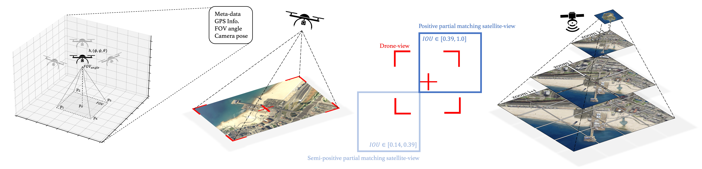
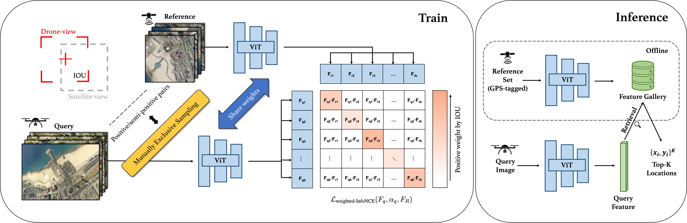

<!-- PROJECT LOGO -->
<p align="center">

  <h3 align="center">Game4Loc: A UAV Geo-Localization Benchmark from Game Data</h3>

</p>

<p align="center">
  By <a href="https://yux1angji.github.io/" target='_blank'>Yuxiang Ji*</a>,&nbsp;
  Boyong He*,&nbsp; Zhuoyue Tan,&nbsp; Liaoni Wu
</p>

<p align="center">
  
  <br>
  <i>
  Localization in flight trajectory after pre-trained on GTA-UAV dataset.
  </i>
</p>

<p align="center">
  <a href="https://yux1angji.github.io/game4loc/"><strong>[Project Page]</strong></a> |
  <a href="https://arxiv.org/abs/2409.16925"><strong>[Arxiv]</strong></a>
</p>

- [x] Part I: Dataset
- [x] Part II: Train and Test
- [x] Part III: Pre-trained Checkpoints

## <a id="news"></a> 🔥 News

- [Dec 10, 2024]: Game4Loc is accepted by AAAI'25 🎉
- [Sep 28, 2024]: Official GTA-UAV dataset release 🚧

## <a id="table-of-contents"></a> 📚 Table of contents

- [Dataset Highlights](#dataset-highlights)
- [Dataset Access](#dataset-access)
- [Dataset Structure](#dataset-structure)
- [Train and Test](#train-and-test)
- [More Features](#more-features)
- [Pre-trained Checkpoints](#pre-trained-checkpoints)
- [License](#license)
- [Acknowledgments](#acknowledgments)
- [Citation](#citation)


## <a id="dataset-highlights"></a> 🌟 Dataset Highlights

*GTA-UAV data construction*

<b><i>GTA-UAV</i> dataset</b> provides a large continuous area dataset (covering 81.3km<sup>2</sup>) for UAV visual geo-localization, expanding the previously aligned drone-satellite pairs to **arbitrary drone-satellite pairs** to better align with real-world application scenarios. Our dataset contains:

- 33,763 simulated drone-view images, from multiple altitudes (80-650m), multiple attitudes, multiple scenes (urban, mountain, coast, forest, etc.).

- 14,640 tiled satellite-view images from 4 zoom levels for arbitrarily pairing.

- Overlap (in IoU) of FoV for each drone-satellite pair.

- Drone (camera) 6-DoF labels for each drone image.

## <a id="dataset-access"></a> 💾 Dataset Access
The dataset is released in two versions: low resolution (512x384, 12.8G) and high resolution (1920x1440, 133.6G).

|                                      Low Resolution Version                                      |                                     High Resolution Version                                      |
|:------------------------------------------------------------------------------------------------:|:------------------------------------------------------------------------------------------------:|
| [HuggingFace🤗](https://huggingface.co/datasets/Yux1ang/GTA-UAV-LR) | Released soon |
| [BaiduDisk](https://pan.baidu.com/s/1vjbyDh8sYz47GoP5KBRMZQ?pwd=gtav) | Released soon |


The high resolution dataset will be released soon.

## <a id="dataset-structure"></a> 📁 Dataset Structure

### Directory Structure
```
├─ GTA-UAV
|   ├── drone/
|   |   └── images/
|   |       ├── 200_0001_0000000001.png
|   |       ├── 200_0001_0000000002.png
|   |       └── ...
|   ├── satellite/
|   |   ├── 6_0_0_0.png
|   |   ├── 6_0_0_1.png
|   |   └── ...
|   ├── cross-area-drone2sate-train.json
|   ├── cross-area-drone2sate-test.json
|   ├── same-area-drone2sate-train.json
└── └── same-area-drone2sate-test.json
```

### Example Entry in `x-area-drone2sate-x.json`

This entry provides a detailed description and paired satellite images for a single drone image in the training/test dataset:

```json
{
    "drone_img_dir": "drone/images",
    "drone_img_name": "500_0001_0000025682.png",
    "drone_loc_x_y": [4472.2036708036, 9460.91532053518],
    "sate_img_dir": "satellite",
    "pair_pos_sate_img_list": [
        "4_0_6_13.png"
    ],
    "pair_pos_sate_weight_list": [
        0.47341428718085427
    ],
    "pair_pos_sate_loc_x_y_list": [
        [4492.8, 9331.2]
    ],
    "pair_pos_semipos_sate_img_list": [
        "4_0_6_13.png",
        "5_0_12_27.png",
        "5_0_13_27.png"
    ],
    "pair_pos_semipos_sate_weight_list": [
        0.47341428718085427,
        0.27864086433392504,
        0.2149980058725643
    ],
    "pair_pos_semipos_sate_loc_x_y_list": [
        [4492.8, 9331.2],
        [4320.0, 9504.0],
        [4665.6, 9504.0]
    ],
    "drone_metadata": {
        "height": 494.70794677734375,
        "drone_roll": -0.2723846435546875,
        "drone_pitch": 1.981452226638794,
        "drone_yaw": 84.99999237060547,
        "cam_roll": -90.27238464355469,
        "cam_pitch": 1.981452226638794,
        "cam_yaw": 84.99999237060547
    }
},
```

### Metadata Details

- `drone_loc_x_y`: Provides the 2D location for the centre of drone-view image.

- `pair_pos_sate_img(weight/loc_x_y)_list`: Provides the positive paired satellite image / weight(IOU) / 2D location list.

- `pair_pos_semipos_sate_img(weight/loc_x_y)_list`: Provides the positive & semi-positive paired satellite image / weight(IOU) / 2D location list.

- `drone_metadata`: Provides the height (altitude above ground level), drone pose (roll, pitch, yaw), and camera pose (roll, pitch, yaw) information.


### Collect Your Own Data

You may want to collect your own data from simulated game environments, if so, you could refer [here](DeepGTAV/VPilot/datageneration_GeoLoc.py).

To configure the simulation and collection environment, please refer [DeepGTA](https://github.com/David0tt/DeepGTAV).
Notice that the compiled `DeepGTA` plugin for our GTA-UAV data simulation and collection is located at [here](DeepGTAV/DeepGTAV-PreSIL/bin/Release/).

### Pre-process for UAV-VisLoc

To pre-process the raw [UAV-VisLoc](https://github.com/IntelliSensing/UAV-VisLoc) data into a similar format as GTA-UAV, you can refer [this script](scripts/prepare_dataset/visloc.py).
What's more, you can also refer to it and modify (extend) it to fit your custom similar datasets.

## <a id="train-and-test"></a> 🚀 Train and Test


*Proposed training and test pipeline*

First, install dependencies   
```bash
cd Game4Loc
# install project   
pip install -e .   
pip install -r requirements.txt
```

Then you could simply run the training experiments on GTA-UAV cross-area setting by
```bash
# run experiment (example: GTA-UAV cross-area setting)  
python train_gta.py \
    --data_root <The directory of the GTA-UAV dataset> \
    --train_pairs_meta_file "cross-area-drone2sate-train.json" \
    --test_pairs_meta_file "cross-area-drone2sate-test.json" \
    --model "vit_base_patch16_rope_reg1_gap_256.sbb_in1k" \
    --gpu_ids 0 --label_smoothing 0.05 \
    --lr 0.0001 --batch_size 64 --epoch 5 \
    --with_weight --k 5
```

Or run the training experiments on UAV-VisLoc by
```bash
# run experiment (example: UAV-VisLoc same-area setting)  
python train_visloc.py \
    --data_root <The directory of the UAV-VisLoc dataset> \
    --train_pairs_meta_file "same-area-drone2sate-train.json" \
    --test_pairs_meta_file "same-area-drone2sate-test.json" \
    --model "vit_base_patch16_rope_reg1_gap_256.sbb_in1k" \
    --gpu_ids 0 --label_smoothing 0.05 \
    --lr 0.0001 --batch_size 64 --epoch 20 \
    --with_weight --k 5
```

Or directly run evaluating script from [pre-trained checkpoints](#pre-trained-checkpoints) by
```bash
# run experiment (example: GTA-UAV cross-area setting)  
python eval_gta.py \
    --data_root <The directory of the GTA-UAV dataset> \
    --test_pairs_meta_file "cross-area-drone2sate-test.json" \
    --model "vit_base_patch16_rope_reg1_gap_256.sbb_in1k" \
    --checkpoint_start <The path of the pre-trained checkpoints>
    --gpu_ids 0
```

## <a id="more-features"></a> 💡 More Features

### Finer Localization with Post-process
Some studies divide localization into two parts: retrieval and matching. Our work focuses on the first part. 
Nevertheless, we also provide support for finer localization based on image matching (Thanks to the excellent zero-shot capabilities of [GIM](https://github.com/xuelunshen/gim/)). 
Set `with_match=True` in [eval script](Game4Loc/eval_gta.py) if needed.

## <a id="pre-trained-checkpoints"></a> 🤗 Pre-trained Checkpoints
The pre-trained models (two version: cross-area/same-area) are available at [Huggingface](https://huggingface.co/Yux1ang/gta_uav_pretrained_models) and [BaiduDisk](https://pan.baidu.com/s/1jle03w4iB9MXg6ATZubSjg?pwd=37jq).

## <a id="license"></a> 🎫 License
This project is licensed under the [Apache 2.0 license](LICENSE).

## <a id="acknowledgments"></a> 🙏 Acknowledgments 
This work draws inspiration from the following code as references. We extend our gratitude to these remarkable contributions:

- [Sample4Geo](https://github.com/Skyy93/Sample4Geo)
- [DeepGTA](https://github.com/David0tt/DeepGTAV)
- [GTA-V-Wolrd-Map](https://github.com/Flamm64/GTA-V-World-Map)
- [GIM](https://github.com/xuelunshen/gim/)

## <a id="citation"></a> 📌 Citation
If you find our repository useful for your research, please consider citing our paper:
```bibtex
@article{ji2024game4loc,
    title  = {Game4Loc: A UAV Geo-Localization Benchmark from Game Data},
    author = {Ji, Yuxiang and He, Boyong and Tan, Zhuoyue and Wu, Liaoni},
    journal= {arXiv preprint arXiv:2409.16925},
    year   = {2024},
}
```
