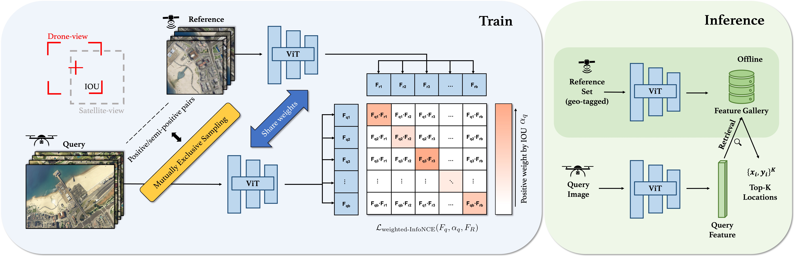

<!-- PROJECT LOGO -->
<br />
<p align="center">

  <h3 align="center">Game4Loc: A UAV Geo-Localization Benchmark from Game Data</h3>

</p>


*GTA-UAV data construction*

- [x] Part I: Dataset
- [x] Part II: Train and Test
- [ ] Part III: Pre-trained Checkpoints

## Table of contents

- [Dataset Highlights](#dataset-highlights)
- [Dataset Structure](#dataset-structure)
- [Train and Test](#train-and-test)
- [Pre-trained Models](#pre-trained-models)
- [License](#license)
- [Acknowledgments](#acknowledgments)
- [Citation](#citation)


## Dataset Highlights
<b><i>GTA-UAV</i> dataset</b> provides a large continuous area dataset (covering 81.3km<sup>2</sup>) for UAV visual geo-localization, expanding the previously aligned drone-satellite pairs to **arbitrary drone-satellite pairs** to better align with real-world application scenarios. Our dataset contains:

- 28,405 simulated drone-view images, from multiple altitudes (200-650m), multiple attitudes, multiple scenes (urban, mountain, seaside, forest, etc.).

- 3,632 tiled satellite-view images from 3 zoom levels for arbitrarily pairing.

- IoU of FoV for each drone-satellite pair.

- Drone (camera) pose labels for each drone image.

## Dataset Structure

### Directory Structure
```
├─ GTA-UAV
|   ├── drone/
|   |   ├──images/
|   |   |   ├── 100_0001_0000000001.png
|   |   |   ├── 200_0001_0000000001.png
|   |   |   └── ...
|   |   └──meta_data/
|   |       ├── 100_0001_0000000001.txt
|   |       ├── 200_0001_0000000001.txt
|   |       └── ...
|   ├── cross-area-drone2sate-train.json
|   ├── cross-area-drone2sate-test.json
|   ├── same-area-drone2sate-train.json
|   └── same-area-drone2sate-test.json
```

### Example Entry in `x-area-drone2sate-x.json`

This entry provides a detailed description and paired satellite images for a single drone image in the training/test dataset:

```json
{
  "drone_img_dir": "drone/images",
  "drone_img_name": "500_0001_0000024847.png",
  "drone_loc_x_y": [
      3633.472345321685,
      7140.565493165591
  ],
  "sate_img_dir": "satellite",
  "pair_pos_sate_img_list": [
      "5_10_20.png"
  ],
  "pair_pos_sate_weight_list": [
      0.5786491782179856
  ],
  "pair_pos_sate_loc_x_y_list": [
      [
          3628.8,
          7084.8
      ]
  ],
  "pair_pos_semipos_sate_img_list": [
      "4_5_10.png",
      "5_10_20.png",
      "6_20_41.png",
      "6_21_40.png",
      "6_21_41.png"
  ],
  "pair_pos_semipos_sate_weight_list": [
      0.25622919559581886,
      0.5786491782179856,
      0.2188736257558427,
      0.19654190179816708,
      0.19387413912296475
  ],
  "pair_pos_semipos_sate_loc_x_y_list": [
      [
          3801.6,
          7257.6
      ],
      [
          3628.8,
          7084.8
      ],
      [
          3542.4,
          7171.2
      ],
      [
          3715.2000000000003,
          6998.400000000001
      ],
      [
          3715.2000000000003,
          7171.2
      ]
  ],
  "drone_metadata": {
      "height": 501.8125,
      "drone_roll": 4.607879638671875,
      "drone_pitch": 2.0246360301971436,
      "drone_yaw": 40.999996185302734,
      "cam_roll": -85.39212036132812,
      "cam_pitch": 2.0246360301971436,
      "cam_yaw": 40.999996185302734
  }
}
```

### Metadata Details

- `drone_loc_x_y`: Provides the 2D location for the centre of drone-view image.

- `pair_pos_sate_img(weight/loc_x_y)_list`: Provides the positive paired satellite image / weight(IOU) / 2D location list.

- `pair_pos_semipos_sate_img(weight/loc_x_y)_list`: Provides the semi-positive paired satellite image / weight(IOU) / 2D location list.

- `drone_metadata`: Provides the height (altitude above ground level), drone pose (roll, pitch, yaw), and camera pose (roll, pitch, yaw) information.


### Collect Your Own Data

You may want to collect your own data from simulated game environments, if so, you could refer x.


## Train and Test


*Proposed training and test pipeline*

First, install dependencies   
```bash
# install project   
pip install -e .   
pip install -r requirements.txt
```

## Pre-trained Models


## License


## Acknowledgments 
This work draws inspiration from the following code as references. We extend our gratitude to these remarkable contributions:

- [Sample4Geo](https://github.com/Skyy93/Sample4Geo)
- [DeepGTA](https://github.com/David0tt/DeepGTAV)
- [GTA-V-Wolrd-Map](https://github.com/Flamm64/GTA-V-World-Map)

## Citation

